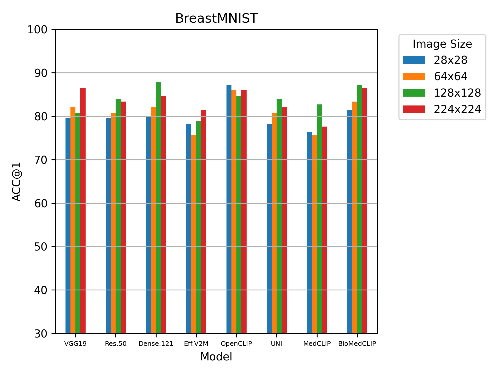
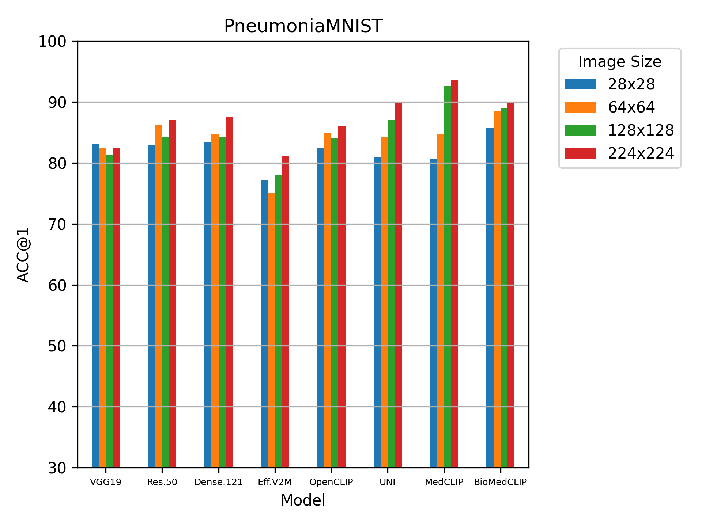
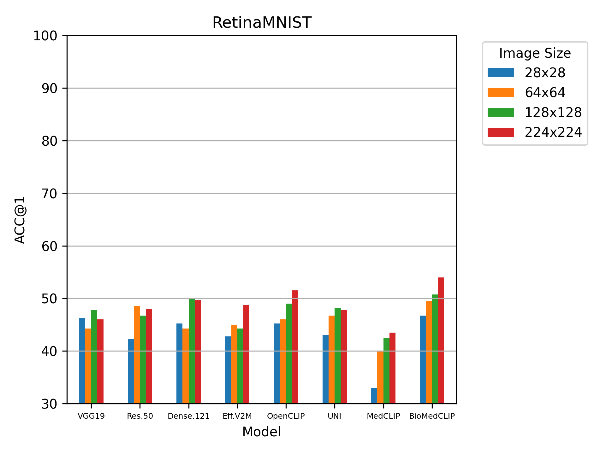
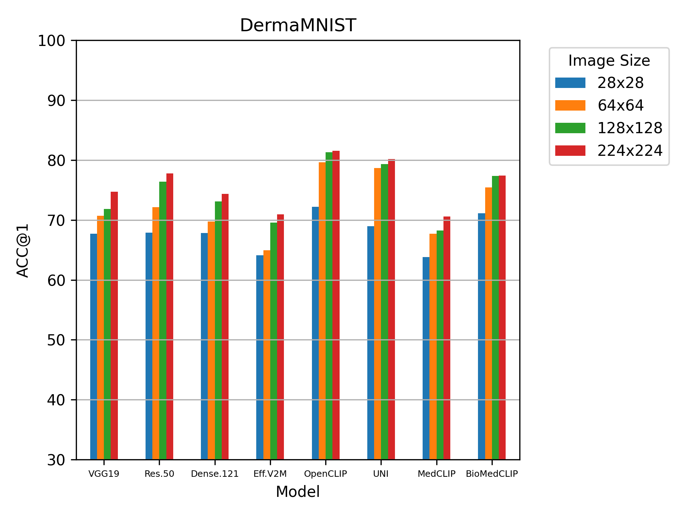
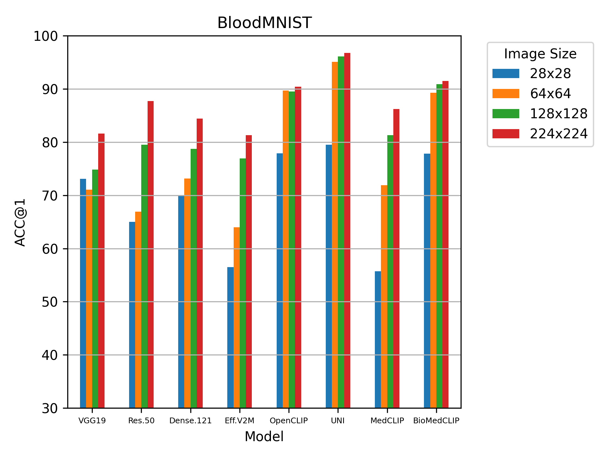
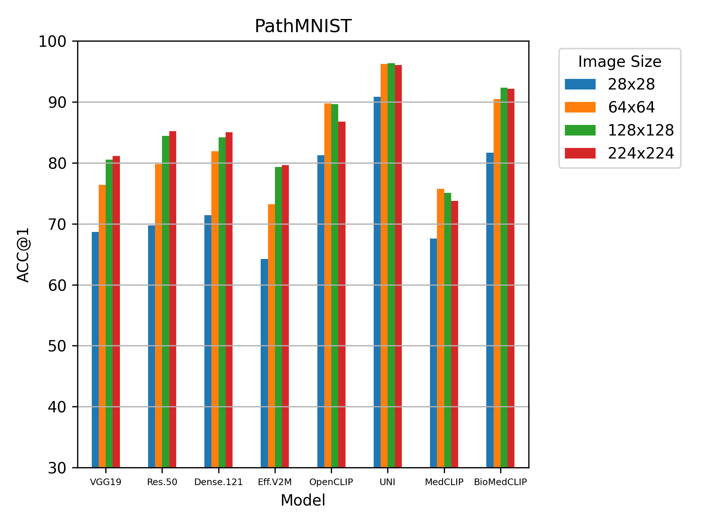
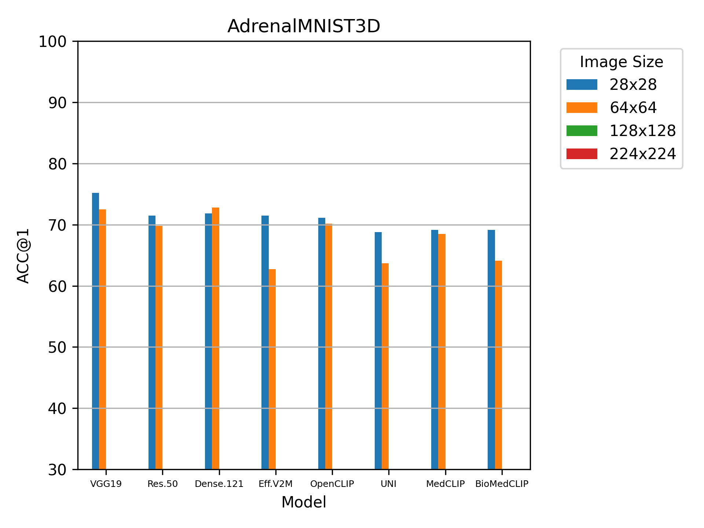
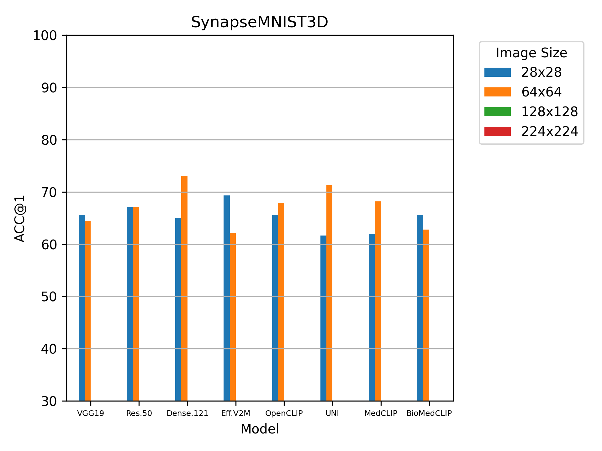

[](https://www.python.org/)

# Evaluating Pre-trained Convolutional Neural Networks and Foundation Models as Feature Extractors for Content-based Medical Image Retrieval

## Dataset: a subset of MedMNIST V2 

## Feature extractors:
- VGG19
- ResNet50
- DenseNet121
- EfficientNetV2M
- OpenCLIP
- UNI (aslo tested with CONCH and VIRCHOW)
- MedCLIP
- BioMedClip

## Similarity:
Cosine similarity index

## Evaluation:
- mAP@5
- MMV@5
- ACC@1
- ACC@3
- ACC@5

## Results:
### for different datasets based on models and input image size
<div style="display: flex; justify-content: space-around;">
  
  
</div>

<div style="display: flex; justify-content: space-around;">
  
  
</div>

<div style="display: flex; justify-content: space-around;">
  
  
</div>

<div style="display: flex; justify-content: space-around;">
  
  
</div>


## How to run:
- For pre-trained CNNs for 2D datasets run `main_2D_CNN.py`
- For pre-trained CNNs for 2D datasets (if your memory is limited to load the entire data) run `main_2D_CNN_memory_safe`
- For pre-trained foundation models for 2D datasets run `main_2D_foundation.py`
- For pre-trained foundation models for 2D datasets (if your memory is limited to load the entire data) run `main_2D_foundation_memory_safe `
- For pre-trained models (CNN or foundation) for 3D datasets run `main_3D.py`
- To create bar charts run `plot.py`

## Used repositories/sources:
- For CNNs: https://www.tensorflow.org/api_docs/python/tf/keras/applications
- For OpenCLIP: https://github.com/mlfoundations/open_clip
- For UNI: https://github.com/mahmoodlab/UNI
- For MedCLIP: https://github.com/RyanWangZf/MedCLIP
- For BioMedCLIP: https://huggingface.co/microsoft/BiomedCLIP-PubMedBERT_256-vit_base_patch16_224/blob/main/biomed_clip_example.ipynb

## Citation:
Will be updated
```
@article{,
title = "Evaluating Pre-trained Convolutional Neural Networks and Foundation Models as Feature Extractors for Content-based Medical Image Retrieval",
journal = "",
volume = "",
pages = "",
year = "2024",
doi = "",
author = "Amirreza Mahbod and Nematollah Saeidi and Ramona Woitek"
}
```


## Contact:
Amirreza Mahbod
amirreza.mahbod@dp-uni.ac.at

## References:
- VGG19: Simonyan, Karen, and Andrew Zisserman. "Very deep convolutional networks for large-scale image recognition." arXiv preprint arXiv:1409.1556 (2014).
- ResNet50: He, Kaiming, et al. "Deep residual learning for image recognition." Proceedings of the IEEE conference on computer vision and pattern recognition. 2016.
- DenseNet121: Huang, Gao, et al. "Densely connected convolutional networks." Proceedings of the IEEE conference on computer vision and pattern recognition. 2017.
- EfficientNetV2M: Tan, Mingxing, and Quoc Le. "Efficientnetv2: Smaller models and faster training." International conference on machine learning. PMLR, 2021.
- OpenCLIP: Cherti, Mehdi, et al. "Reproducible scaling laws for contrastive language-image learning." Proceedings of the IEEE/CVF Conference on - Computer Vision and Pattern Recognition. 2023.
- UNI: Chen, Richard J., et al. "Towards a general-purpose foundation model for computational pathology." Nature Medicine 30.3 (2024): 850-862.
- MedCLIP: Wang, Zifeng, et al. "Medclip: Contrastive learning from unpaired medical images and text." arXiv preprint arXiv:2210.10163 (2022).
- BioMedClip: Zhang, Sheng, et al. "BiomedCLIP: a multimodal biomedical foundation model pretrained from fifteen million scientific image-text pairs." arXiv preprint arXiv:2303.00915 (2023).


